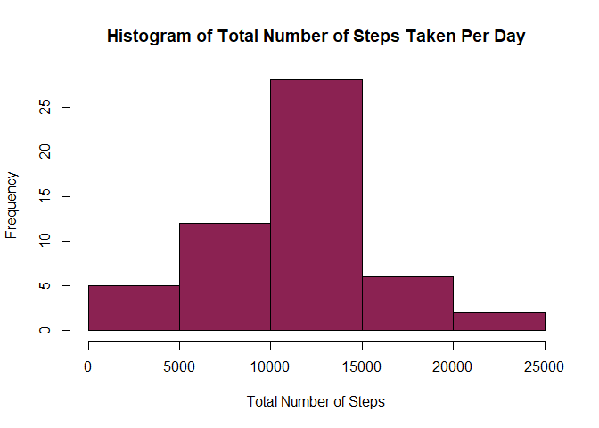

## Loading and preprocessing the data

```r
library(dplyr)
```

```
## 
## Attaching package: 'dplyr'
```

```
## The following objects are masked from 'package:stats':
## 
##     filter, lag
```

```
## The following objects are masked from 'package:base':
## 
##     intersect, setdiff, setequal, union
```

```r
wd <- getwd()
unzip("activity.zip", exdir=wd)

activity <- read.csv("activity.csv")
activity$date <- as.Date(activity$date)

activity_tidy<- activity %>% group_by(date) %>% 
  summarise(sum_steps = sum(steps)) 
```

## What is mean total number of steps taken per day?

Plot the histogram

```r
hist(activity_tidy$sum_steps,col="violetred4",main="Histogram of Total Number of Steps Taken Per Day",xlab="Total Number of Steps")
```

<!-- -->

Computation Code

```r
mean <- mean(activity_tidy$sum_steps, na.rm=TRUE)
median <- quantile(activity_tidy$sum_steps, probs=0.5, na.rm=TRUE)
```

The mean total number of steps taken per day is 1.0766189\times 10^{4} and the median total number of steps taken per day is 1.0765\times 10^{4}.

## What is the average daily activity pattern?

Plot the time series plot

```r
activityv2 <- activity %>% group_by(interval) %>%
  summarise(mean_steps = mean(steps,na.rm=TRUE))

with(activityv2, plot(interval,mean_steps,type="l",
                      main = "Average Steps Taken Per 5 Mins Interval",
                      ylab = "Average Number of Steps",
                      xlab = "Time(Minutes)"))
```

<!-- -->

Find the 5-mins interval containing maximum number of steps

```r
rowmax<- activityv2[row(activityv2)[activityv2==max(activityv2$mean_steps)],]
interval_max <- rowmax$interval
```

The 835 minutes interval, on average across all days in the dataset, contains the maximum number of steps.

## Imputing missing values

```r
no_missing <- sum(is.na(activity$steps))
```

The total number of missing values in the dataset is 2304.

Using the mean for that 5-minute interval, we would fill up the missing values.

```r
interval_list <- unique(activity$interval)
for(i in seq_along(interval_list)) {
  activity$steps[is.na(activity$steps) & activity$interval==interval_list[i]] <- activityv2$mean_steps[activityv2$interval == interval_list[i]]   
}
```

Plot the histogram of the total steps taken each day with the new dataset

```r
activity_tidy2<- activity %>% group_by(date) %>% 
  summarise(sum_steps = sum(steps)) 
hist(activity_tidy2$sum_steps,col="violetred2",main="Histogram of Total Number of Steps Taken Per Day",xlab="Total Number of Steps")
```

<!-- -->

Computation Code

```r
mean2 <- mean(activity_tidy2$sum_steps, na.rm=TRUE)
median2 <- quantile(activity_tidy2$sum_steps, probs=0.5, na.rm=TRUE)
diff_mean <- mean2 - mean
diff_med <- median2 - median
```

The mean total number of steps taken per day is 1.0766189\times 10^{4} and the median total number of steps taken per day is 1.0766189\times 10^{4}.

The difference between the mean is 0 and the median is 1.1886792.
The impact of inputing the missing data does not have a huge impact on the estimates of the total daily steps.

## Are there differences in activity patterns between weekdays and weekends?


```r
activity <- activity %>% mutate(weekdays=weekdays(activity$date))
weekdays1 <- c('Monday', 'Tuesday', 'Wednesday', 'Thursday', 'Friday')
#Use `%in%` and `weekdays` to create a logical vector
activity$wDay <- factor((activity$weekdays %in% weekdays1),
levels=c(FALSE, TRUE), labels=c('weekend', 'weekday'))


activity_wDay <- activity %>% group_by(interval, wDay) %>%
  summarise(mean_steps = mean(steps,na.rm=TRUE))
```

```
## `summarise()` has grouped output by 'interval'. You can override using the `.groups` argument.
```

```r
#plot the time series chart
library(ggplot2)
g <- ggplot(activity_wDay, aes(interval, mean_steps))
g+geom_line(col="steelblue")+facet_grid(wDay~.)+
  theme_minimal()+labs(y = "Average Steps Taken")+
  labs(x = "Time (Minutes)")+labs(title="Average Steps Taken for Weekdays VS Weekends")
```

<!-- -->
